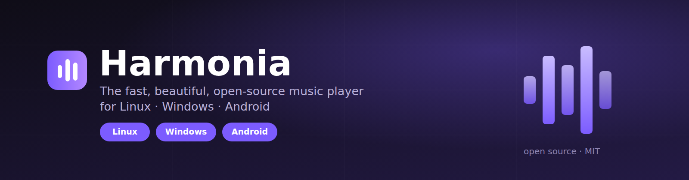
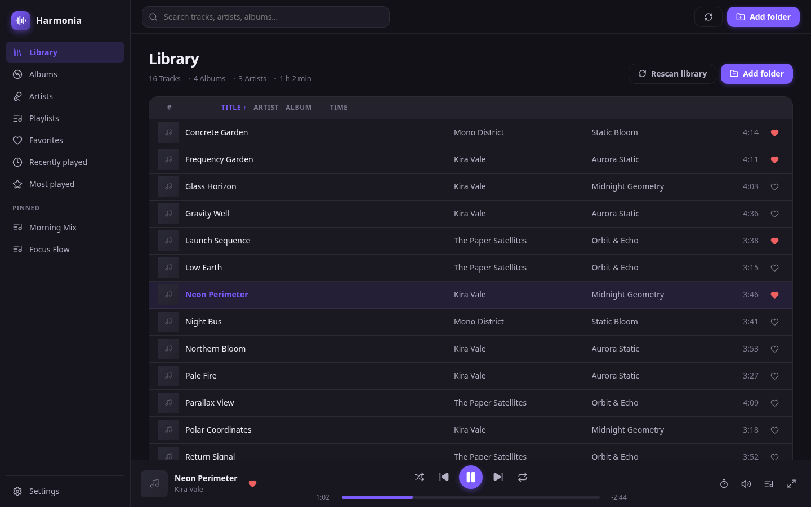
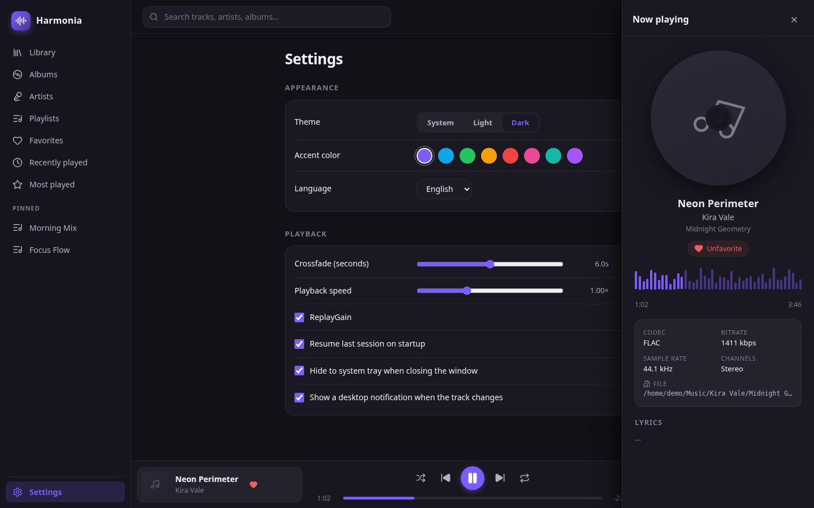
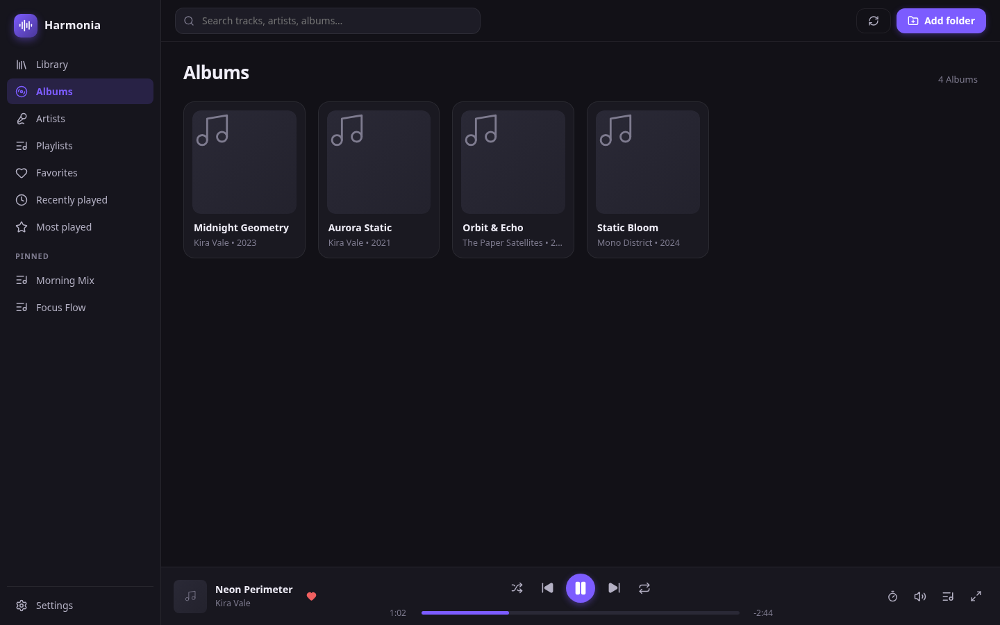
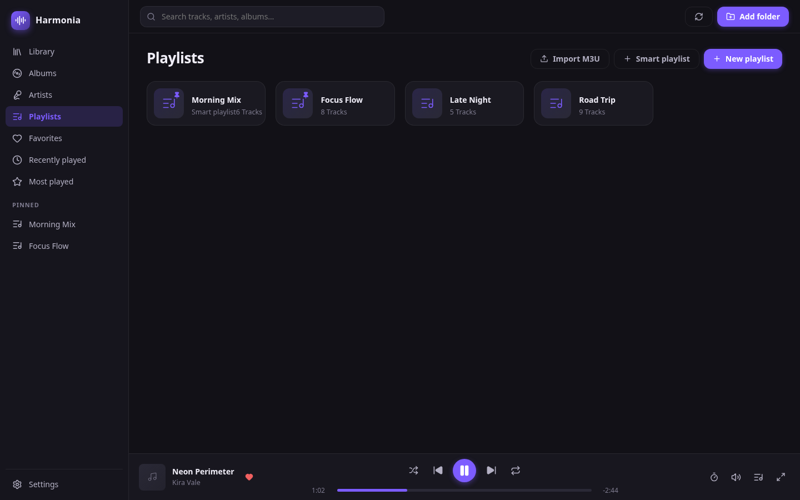
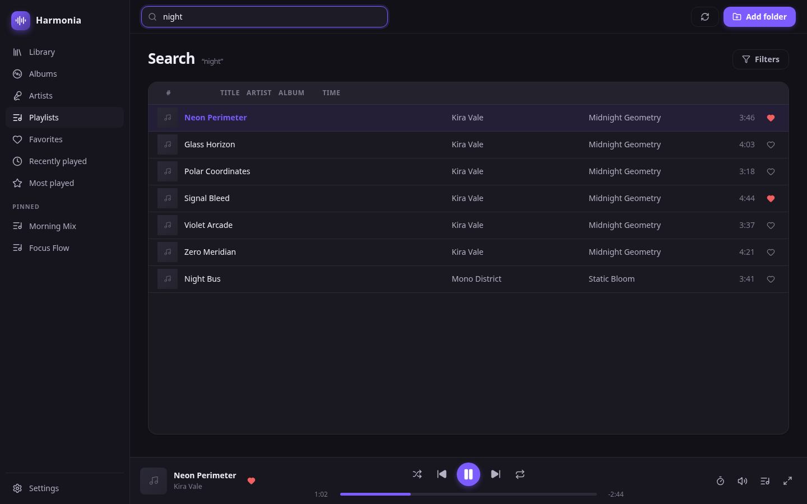
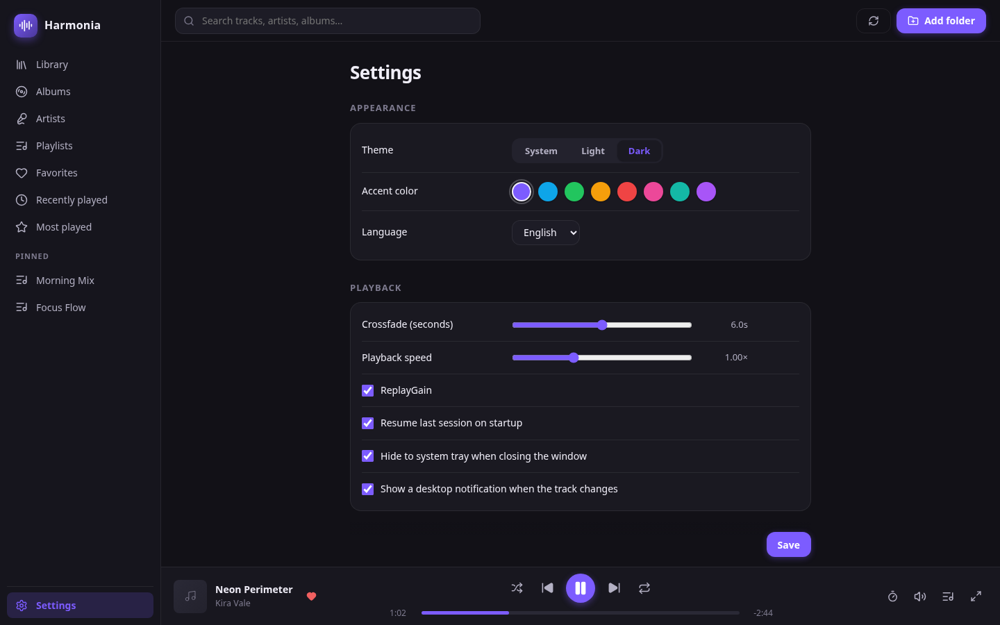
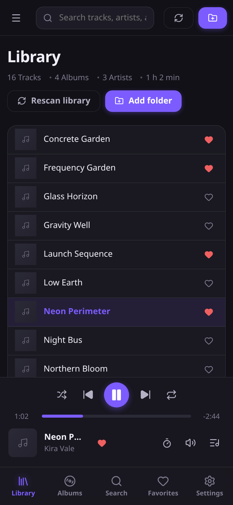
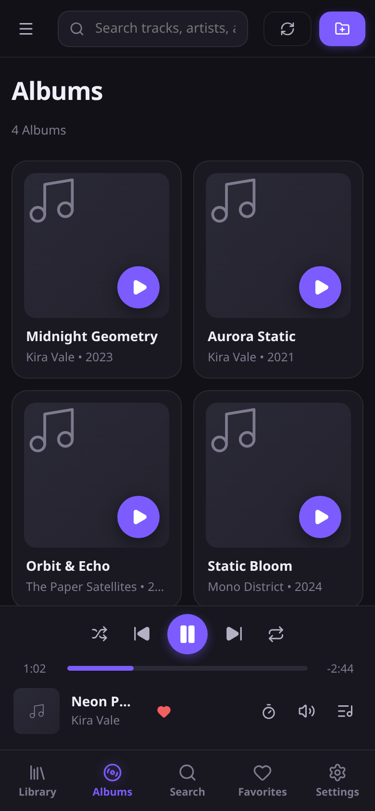
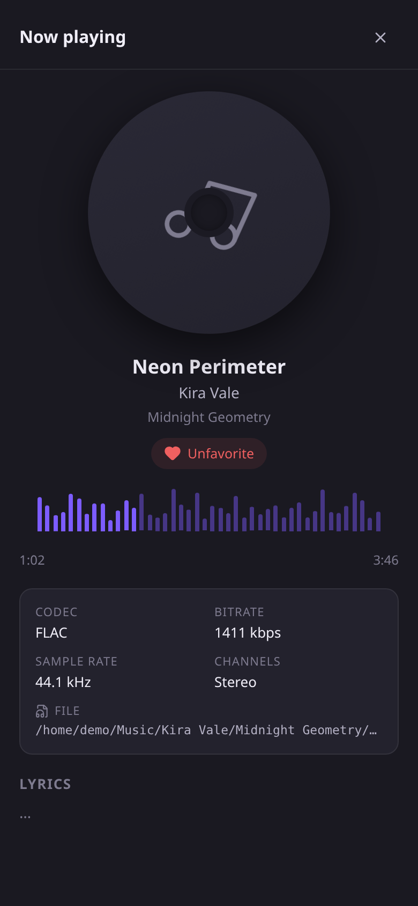

<p align="center">
  
</p>

<h1 align="center">Harmonia</h1>

<p align="center">
  <em>A fast, beautiful, open-source music player for Linux, Windows &amp; Android.</em><br />
  <b>Rust · Tauri 2 · React · rodio</b> — gapless playback, ReplayGain, a 10-band equalizer and a library that scales to 100,000+ tracks.
</p>

<p align="center">
  <a href="#features">Features</a> ·
  <a href="#screenshots">Screenshots</a> ·
  <a href="#installation">Installation</a> ·
  <a href="#usage">Usage</a> ·
  <a href="#keyboard-shortcuts">Shortcuts</a> ·
  <a href="#documentation">Documentation</a> ·
  <a href="#roadmap">Roadmap</a> ·
  <a href="#faq">FAQ</a>
</p>

<p align="center">
  <a href="https://github.com/bgh30539-code/harmonia/releases/latest"></a>
  <a href="https://github.com/bgh30539-code/harmonia/releases"></a>
  <a href="https://github.com/bgh30539-code/harmonia/actions/workflows/ci.yml"></a>
  <a href="https://github.com/bgh30539-code/harmonia/actions/workflows/release.yml"></a>
  <a href="https://github.com/bgh30539-code/harmonia/blob/main/LICENSE"></a>
  
  
  
</p>

---

## Why Harmonia?

Most music players make you choose: **powerful but ugly**, or **beautiful but slow**. Harmonia refuses the trade-off.

- ⚡ **Fast, always.** Native Rust core, a small Tauri shell, SQLite indexing — cold start in under a second, idle memory below 150 MB, buttery-smooth scrolling even with 100,000 tracks.
- 🎧 **Serious about audio.** Gapless playback, crossfade, ReplayGain, a 10-band equalizer, bass boost, balance, pitch-preserving speed control.
- 🖥️ **Everywhere you listen.** The same codebase ships as a `.deb` and AppImage on Linux, an NSIS installer + portable exe on Windows, and an APK/AAB on Android.
- 🔍 **Built for big libraries.** Multi-threaded scanning, incremental rescans, live filesystem watching, instant full-text search.
- 🎨 **A pleasure to use.** Material-inspired dark/light/system themes, accent colors, keyboard-first workflow, English & Spanish.

## Features

### Library
- Recursive folder scanning with fast multi-threaded indexing
- Incremental rescans (only changed files are re-read) and live filesystem watching
- SQLite database (WAL) with album, artist, playlist and smart-playlist caches
- Full-text search with genre/codec/year/bitrate/duration filters
- Drag & drop files and folders onto the window to import
- 100,000+ track scale with virtualized, paged track lists

### Playback
- Gapless playback and configurable crossfade
- ReplayGain (track gain with album-gain fallback)
- Shuffle, repeat (off / all / one) and a reorderable queue
- Seek, playback-speed control with pitch preservation
- 10-band equalizer, bass boost, balance, mono downmix
- Sleep timer (minutes, end of track, end of album)
- Session resume and per-track position memory

### Metadata & artwork
- MP3 (ID3v1/v2), FLAC (Vorbis comments), OGG, AAC/M4A, WAV
- Embedded artwork extraction with a size-bounded on-disk cache
- Plain and synchronized (LRC-style) lyrics
- Codec, bitrate, sample rate, channels and file path in Now Playing

### Playlists
- Static and **smart playlists** (rule-based, match-all / match-any)
- Recently played, most played, favorites
- Pinned playlists, drag-to-reorder, context-menu actions
- Import/export: M3U, M3U8, PLS, XSPF

### Platform & polish
- System tray with playback controls (Linux/Windows)
- MPRIS media-key integration on Linux; global in-app shortcuts everywhere
- Mini-player mode, desktop notifications, resume banner
- Window size/position and last-opened section remembered across launches
- Linux: desktop file, MIME associations, `.deb` + AppImage bundles
- Windows: NSIS installer with Start Menu/desktop shortcuts, uninstaller, file associations, plus a portable exe
- Android: responsive bottom-navigation UI, media/notification permissions, universal APK + AAB builds
- English & Spanish localization, dark/light/system themes, accent colors

## Screenshots

### Desktop

| Library | Now playing | Albums |
| --- | --- | --- |
|  |  |  |

| Playlists | Search | Settings |
| --- | --- | --- |
|  |  |  |

### Android

| Library | Albums | Player |
| --- | --- | --- |
|  |  |  |

## Installation

Grab the latest binaries from the **[releases page](https://github.com/bgh30539-code/harmonia/releases)**. Every release ships:

| Platform | Artifact |
| --- | --- |
| Linux (Debian/Ubuntu) | `Harmonia_*.deb` |
| Linux (any distro) | `Harmonia_*.AppImage` |
| Windows | `Harmonia_*_setup.exe` (installer) |
| Windows | `harmonia.exe` (portable, no install) |
| Android (8.0+, API 26) | `app-universal-release.apk` (+ `.aab`) |

### Linux

```bash
# Debian / Ubuntu — install the .deb
sudo apt install ./Harmonia_*.deb

# Or run the AppImage anywhere
chmod +x Harmonia-*.AppImage
./Harmonia-*.AppImage
```

> Ubuntu 22.04+ / Debian 12+ ship FUSE 3 only — AppImages need FUSE 2:
> `sudo apt install libfuse2`, or run with `APPIMAGE_EXTRACT_AND_RUN=1`.

### Windows

Run `Harmonia_*_setup.exe` — it adds a Start Menu shortcut, optional desktop shortcut, an uninstaller, and registers `mp3`/`flac`/`ogg`/`wav`/`m4a` file associations so double-clicking a music file opens Harmonia.

Prefer portable? Download `harmonia.exe` and run it directly — no installation (Windows 10/11 ship the WebView2 runtime it uses).

### Android

Download `app-universal-release.apk` and side-load it (enable *Install unknown apps* for your downloader app). On first launch Harmonia asks for permission to read your music (scoped storage) and to show notifications, then indexes the standard shared music folders (Music, Download).

> Background playback with notification/lock-screen controls, system folder picking (SAF) and full media-store discovery are scheduled for **v0.1.3**. Until then playback continues while the app is open.

### From source

See the [installation guide](docs/INSTALL.md) for full system requirements (WebKitGTK 4.1, ALSA headers, MSVC toolchain…) and the [development guide](docs/DEVELOPMENT.md) for the daily workflow.

```bash
# System deps (Debian/Ubuntu)
sudo apt install libwebkit2gtk-4.1-dev build-essential libssl-dev \
  libxdo-dev libayatana-appindicator3-dev librsvg2-dev libasound2-dev

npm install
npm run tauri dev        # development
npm run tauri build      # release bundles
```

## Usage

1. **Add your music** — on first launch, click *Add folder* in the Library header (or drag & drop folders onto the window). Harmonia scans in the background and updates live as files change.
2. **Play** — double-click a track, or select a context (album, artist, playlist, favorites) and hit play. The queue is reorderable from the queue button in the player bar.
3. **Search** — press `Ctrl+F` and type; filter by genre, year, bitrate, duration and more.
4. **Tune** — Settings → Audio: output device, ReplayGain, crossfade, equalizer, bass boost, balance, mono.
5. **Organize** — create smart playlists from rules (e.g. *genre is Ambient and year >= 2020*), pin favorites, export to M3U/PLS/XSPF.

## Keyboard shortcuts

| Key | Action |
| --- | --- |
| `Space` | Play / pause |
| `Ctrl/Cmd + →` | Next track |
| `Ctrl/Cmd + ←` | Previous track |
| `→` / `←` | Seek forward / back 5 s |
| `↑` / `↓` | Volume up / down |
| `M` | Mute / unmute |
| `Ctrl/Cmd + F` | Focus search |

## Supported formats

| Format | Decoder |
| --- | --- |
| MP3 | ID3v1/v2 tags |
| FLAC | Vorbis comments, embedded artwork |
| OGG / Opus | Vorbis comments |
| M4A / AAC / MP4 | MP4 tags |
| WAV | RIFF metadata |

Artwork is extracted from embedded tags; lyrics are supported in plain and synchronized (LRC-style) form.

## Documentation

| Document | Contents |
| --- | --- |
| [INSTALL.md](docs/INSTALL.md) | System requirements and install instructions per distro |
| [DEVELOPMENT.md](docs/DEVELOPMENT.md) | Setting up a dev environment, testing, tooling, release process |
| [ARCHITECTURE.md](docs/ARCHITECTURE.md) | Design decisions and module responsibilities |
| [CONTRIBUTING.md](CONTRIBUTING.md) | How to contribute, code style, PR workflow |
| [ROADMAP.md](docs/ROADMAP.md) | Planned features and milestones |
| [SECURITY.md](SECURITY.md) | Reporting security vulnerabilities |
| [SUPPORT.md](SUPPORT.md) | Getting help |
| [CODE_OF_CONDUCT.md](CODE_OF_CONDUCT.md) | Community guidelines |

## Roadmap

See [docs/ROADMAP.md](docs/ROADMAP.md) for the full plan. Highlights:

- **v0.1.3** — Android background playback (media session, notification/lock-screen controls, audio focus) and media-store auto-discovery
- **v0.2** — podcasts, internet radio, tag editor, duplicate finder, MusicBrainz enrichment
- **v0.3** — Last.fm scrobbling, listening statistics, custom CSS themes
- **v0.4** — plugin system, real spectrum visualizer, detachable windows

## FAQ

**Why Rust + Tauri instead of Electron?**
Memory safety for the audio engine, and a native webview (WebKitGTK / WebView2) instead of a bundled browser — idle memory stays below 150 MB and startup under a second.

**How large can my library be?**
The index is designed for 100,000+ tracks. Track lists are virtualized and paged; scans are incremental, so rescanning a changed folder only re-reads changed files.

**Where does Harmonia store its database?**
In the platform app-data directory (e.g. `~/.local/share/harmonia` on Linux). Your music files are never moved or modified.

**Can I import/export playlists?**
Yes — M3U, M3U8, PLS and XSPF import and export.

**Does Android support background playback?**
Not yet. v0.1.2 plays while the app is open; background playback with media-session controls, audio focus and headset controls is the v0.1.3 priority.

**Is there Last.fm scrobbling?**
Planned for v0.3.

**Do you support macOS?**
Not yet — it's on the long-term roadmap (Tauri supports macOS out of the box; the remaining work is packaging and platform integration).

## Troubleshooting

| Problem | Fix |
| --- | --- |
| AppImage won't start (`libfuse.so.2`) | `sudo apt install libfuse2` or `APPIMAGE_EXTRACT_AND_RUN=1 ./Harmonia-*.AppImage` |
| No audio output | Make sure PipeWire/PulseAudio is running; pick a device in Settings → Audio |
| Media keys do nothing | Ensure MPRIS is enabled (default) and no other player is grabbing the keys |
| Build fails on `webkit2gtk-sys` / `alsa-sys` | Install the `-dev` packages listed in [docs/INSTALL.md](docs/INSTALL.md) |
| Android app shows an empty library | Grant the media permission (Settings → Apps) and tap *Add folder* to re-scan |

## Contributing

Contributions are welcome — bug reports, translations, documentation and code. Please read [CONTRIBUTING.md](CONTRIBUTING.md) first, and note our [Code of Conduct](CODE_OF_CONDUCT.md).

- Found a bug or have an idea? [Open an issue](https://github.com/bgh30539-code/harmonia/issues/new).
- Check the [roadmap](docs/ROADMAP.md) for planned work.
- All code is held to a high bar: `cargo fmt`, `cargo clippy -- -D warnings`, `tsc --noEmit` and a green CI before merge.

## License

[MIT](LICENSE) © 2026 Harmonia contributors. By contributing you agree your contributions are licensed under the MIT License.

## Acknowledgements

- [Tauri](https://tauri.app) — the tiny, fast app shell
- [rodio](https://github.com/rustaudio/rodio) & [symphonia](https://github.com/pdeljanov/Symphonia) — audio decoding and output
- [lofty](https://github.com/Serial-ATA/lofty-rs) — metadata and artwork parsing
- [rusqlite](https://github.com/rusqlite/rusqlite) — the SQLite index
- [notify](https://github.com/notify-rs/notify) — live filesystem watching
- [React](https://react.dev) & [lucide-react](https://lucide.dev) — the interface
- Our contributors — thank you for making Harmonia better
